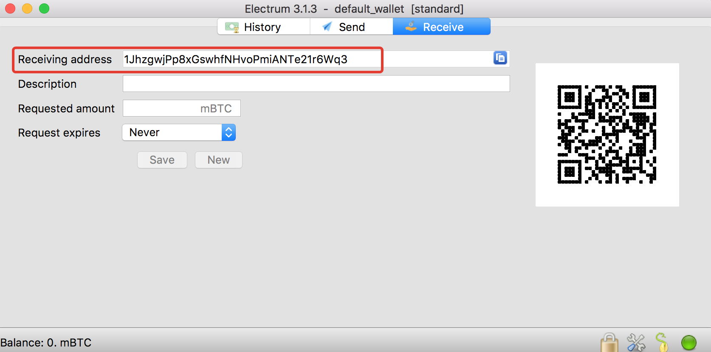
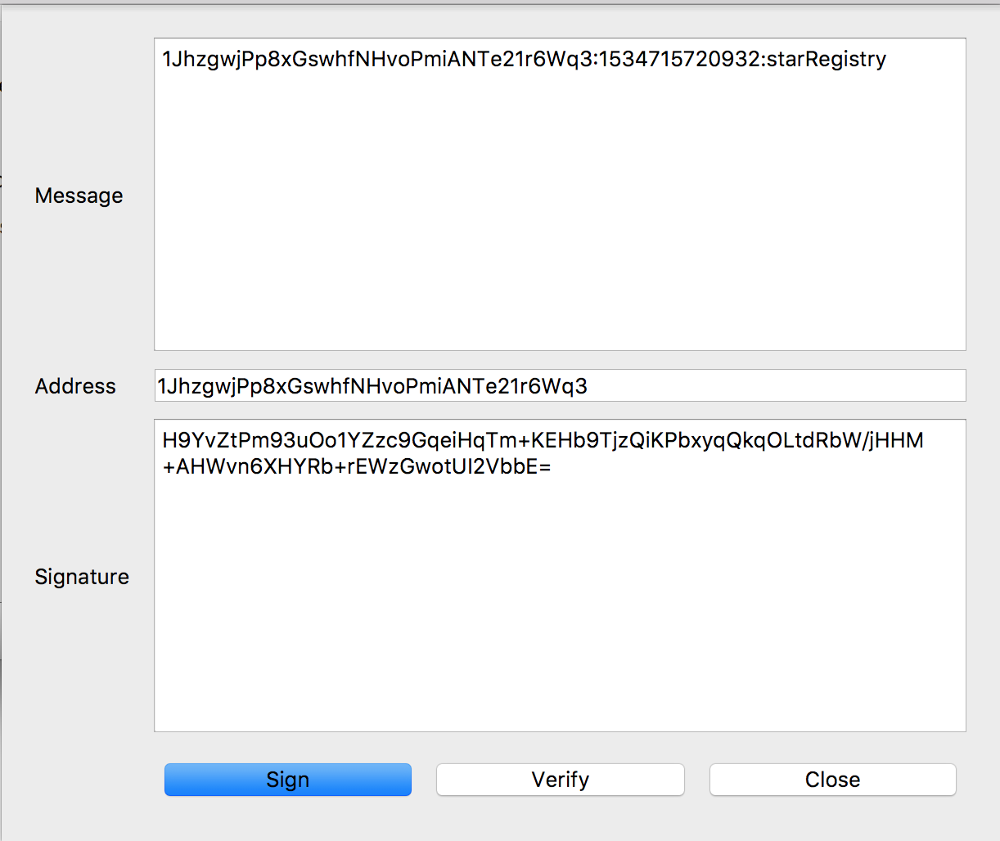

# Private Blockchain Notary Service

## Project Description 
Project is implement the star registry notarization web API.
* The star registry service will notarize star ownership utilizing your blockchain identity.
* The service will provide a message to verify wallet address utilizing message signature as proof. Verification process contains a validation window of five minutes.
* Once a wallet address is verified, the owner has the right to register the star.
* Each star has the ability to share a story. The story will support Ascii text which is encoded in hexadecimal format within our private blockchain.
* The web API will provide functionality to look up the star by the star hash, star block height, or wallet address (blockchain ID).

## Node.js framework
This project uses framework [Sails.js](https://sailsjs.com/) to serve the application.

## How to start
1. Clone this repository or download as a zip file (in this case you should unpacked it) .

2. Install the dependencies.
```bash
npm install
```
3. Run the project 
```bash
npm run start 
```
4. Service will be available at [http://localhost:8000/](http://localhost:8000/)

## Endpoints Description 

### 1. Blockchain ID Validation Request
#### Method
`POST`

#### Endpoint 
`http://localhost:8000/requestValidation`

#### Request Example
```bash
curl -X "POST" "http://localhost:8000/requestValidation" \
     -H 'Content-Type: application/json; charset=utf-8' \
     -d $'{
  "address": "1JhzgwjPp8xGswhfNHvoPmiANTe21r6Wq3"
}'
```

#### Response Example
```json
{
    "address": "1JhzgwjPp8xGswhfNHvoPmiANTe21r6Wq3",
    "requestTimeStamp": 1534715309309,
    "message": "1JhzgwjPp8xGswhfNHvoPmiANTe21r6Wq3:1534715309309:starRegistry",
    "validationWindow": 300
}
```

#### Parameter `address`
`address` is a bitcoin wallet address. For a testing purpose you can use [Electrum Bitcon Wallet](https://electrum.org/#home).



### 2. Blockchain ID Message Signature Validation 
#### Method
`POST`

#### Endpoint 
`http://localhost:8000/message-signature/validate`

#### Request Example
```bash
curl -X "POST" "http://localhost:8000/message-signature/validate" \
     -H 'Content-Type: application/json; charset=utf-8' \
     -d $'{
  "address": "1JhzgwjPp8xGswhfNHvoPmiANTe21r6Wq3",
  "signature": "IB+x+0k9uV7JaOenw1rCQA4ln3eD3hINMUOcYTJT0NFZB4oOWSfnVKsHA6EYbtylb3KZ17YPHMaLyVxAlFZoCWI="
}'
```

#### Response Example
```json
{
    "registerStar": true,
    "status": {
        "address": "1JhzgwjPp8xGswhfNHvoPmiANTe21r6Wq3",
        "requestTimeStamp": 1534715309309,
        "message": "1JhzgwjPp8xGswhfNHvoPmiANTe21r6Wq3:1534715309309:starRegistry",
        "validationWindow": 265,
        "messageSignature": "valid"
    }
}
```

#### Parameter `signature`
You can get your `signature` parameter using [Electrum Bitcon Wallet](https://electrum.org/#home): `Tools` → `Sign/verify message`. Use `address` and `message` parameters that you got from `Blockchain ID Validation Request` endpoint response.
[Electrum Bitcon Wallet](https://electrum.org/#home).



### 3. Star Registration
#### Method
`POST`

#### Endpoint 
`http://localhost:8000/block`

#### Request Example
```bash
curl -X "POST" "http://localhost:8000/block" \
     -H 'Content-Type: application/json; charset=utf-8' \
     -d $'{
    "address": "1JhzgwjPp8xGswhfNHvoPmiANTe21r6Wq3",
	"star": {
	   "dec": "-1° 2' 3.4",
	    "ra": "00h 00m 0.0s",
	    "story": "Star example story"
	}
}'
```

#### Response Example
```json
{
    "hash": "a1e791905c8dca79546f827ee6dd4d7dca0f860638064b1f400aa1be09ba7222",
    "height": 1,
    "time": "1534715355",
    "previousBlockHash": "2a2e16c1acbd7acc7129fc76c68e643fd3907dfc5af1ac344e030c531a498585",
    "body": {
        "address": "1JhzgwjPp8xGswhfNHvoPmiANTe21r6Wq3",
        "star": {
            "dec": "-1° 2' 3.4",
            "ra": "00h 00m 0.0s",
            "story": "53746172206578616d706c652073746f7279"
        }
    }
}
```

### 4. Stars Lookup by Wallet Address
#### Method
`GET`

#### Endpoint 
`http://localhost:8000/stars/address`:[address]

#### Request Example
```bash
curl "http://localhost:8000/stars/address:1JhzgwjPp8xGswhfNHvoPmiANTe21r6Wq3"
```

#### Response Example
```json
[
    {
        "hash": "a1e791905c8dca79546f827ee6dd4d7dca0f860638064b1f400aa1be09ba7222",
        "height": 1,
        "time": "1534715355",
        "previousBlockHash": "2a2e16c1acbd7acc7129fc76c68e643fd3907dfc5af1ac344e030c531a498585",
        "body": {
            "address": "1JhzgwjPp8xGswhfNHvoPmiANTe21r6Wq3",
            "star": {
                "dec": "-1° 2' 3.4",
                "ra": "00h 00m 0.0s",
                "story": "53746172206578616d706c652073746f7279",
                "storyDecoded": "Star example story"
            }
        }
    },
    {
        "hash": "d28fc1b0d032120673779f8eef84421ef3e9e0b3dc1981d6c74cb21f56737d5a",
        "height": 2,
        "time": "1534715752",
        "previousBlockHash": "a1e791905c8dca79546f827ee6dd4d7dca0f860638064b1f400aa1be09ba7222",
        "body": {
            "address": "1JhzgwjPp8xGswhfNHvoPmiANTe21r6Wq3",
            "star": {
                "dec": "-1° 2' 3.4",
                "ra": "00h 00m 0.0s",
                "story": "537461722032206578616d706c652073746f7279",
                "storyDecoded": "Star 2 example story"
            }
        }
    }
]
```

### 5. Star Lookup by Block Hash
#### Method
`GET`

#### Endpoint 
`http://localhost:8000/stars/hash`:[hash]

#### Request Example
```bash
curl "http://localhost:8000/stars/hash:d28fc1b0d032120673779f8eef84421ef3e9e0b3dc1981d6c74cb21f56737d5a"
```

#### Response Example
```json
{
    "hash": "d28fc1b0d032120673779f8eef84421ef3e9e0b3dc1981d6c74cb21f56737d5a",
    "height": 2,
    "time": "1534715752",
    "previousBlockHash": "a1e791905c8dca79546f827ee6dd4d7dca0f860638064b1f400aa1be09ba7222",
    "body": {
        "address": "1JhzgwjPp8xGswhfNHvoPmiANTe21r6Wq3",
        "star": {
            "dec": "-1° 2' 3.4",
            "ra": "00h 00m 0.0s",
            "story": "537461722032206578616d706c652073746f7279",
            "storyDecoded": "Star 2 example story"
        }
    }
}
```

### 6. Star Lookup by Block Height 
#### Method
`GET`

#### Endpoint 
`http://localhost:8000/block`:[height]

#### Request Example
```bash
curl "http://localhost:8000/block/1"
```

#### Response Example
```json
{
    "hash": "a1e791905c8dca79546f827ee6dd4d7dca0f860638064b1f400aa1be09ba7222",
    "height": 1,
    "time": "1534715355",
    "previousBlockHash": "2a2e16c1acbd7acc7129fc76c68e643fd3907dfc5af1ac344e030c531a498585",
    "body": {
        "address": "1JhzgwjPp8xGswhfNHvoPmiANTe21r6Wq3",
        "star": {
            "dec": "-1° 2' 3.4",
            "ra": "00h 00m 0.0s",
            "story": "53746172206578616d706c652073746f7279",
            "storyDecoded": "Star example story"
        }
    }
}
```

### Testing Endpoints
For testing endpoints you can also using different GUI tools. For example: [Postman](https://www.getpostman.com).